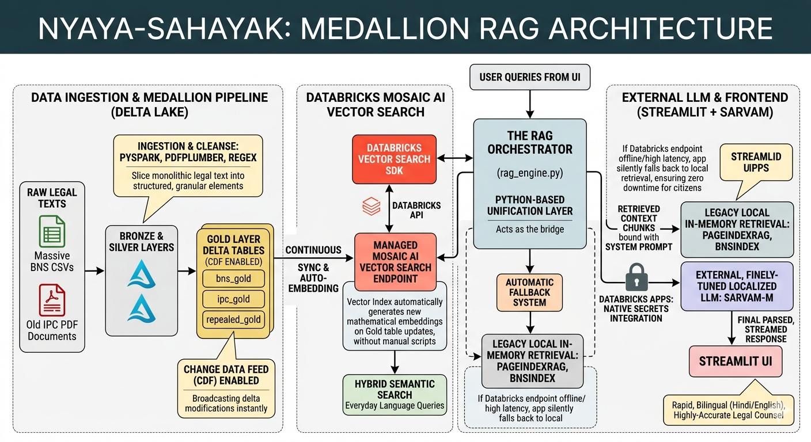
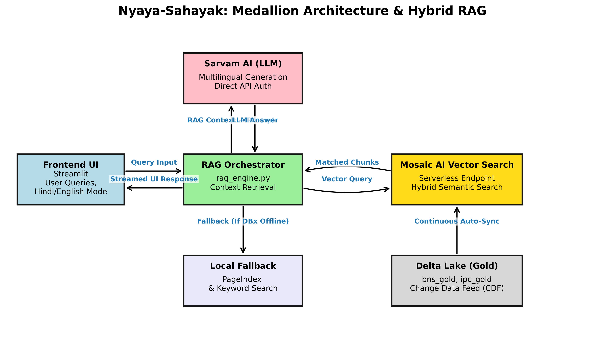

# Nyaya-Sahayak: Intelligent Legal Assistant ⚖️

Nyaya-Sahayak is an AI-powered legal application designed to help citizens and professionals navigate the transition from the old Indian Penal Code (IPC 1860) to the new Bharatiya Nyaya Sanhita (BNS 2023).

Built on top of a highly scalable **Databricks Medallion Architecture**, this app utilizes **Databricks Mosaic AI Vector Search** coupled with localized LLMs (Sarvam AI) for robust, highly accurate Retrieval-Augmented Generation (RAG).

---

## 🏗️ Architecture

### 1. The Medallion RAG Pipeline
* **Bronze & Silver Layers**: Raw IPC PDFs and BNS CSV datasets are ingested and cleansed into granular components using PySpark.
* **Gold Layer**: Delta Tables (`bns_gold`, `ipc_gold`, `repealed_gold`) with **Change Data Feed (CDF)** enabled.
* **Mosaic AI Vector Search**: Provides continuous synchronization and embedding updates via Databricks Managed Endpoints.
* **RAG Orchestrator**: Bridges the Databricks endpoints with a seamless **Local In-Memory Fallback Mechanism** ensuring zero downtime.

### High-Level Architecture Diagram


### Component Flow Diagram


---

## 🚀 How to Run & Deploy

### Option 1: Run Locally (Development)

**1. Clone the repository and install dependencies:**
```bash
git clone https://github.com/IamSaransh/nayay-sahinta-databricks.git
cd nayay-sahinta-databricks
conda create -n databrics python=3.10 -y
conda activate databrics
pip install -r requirements_dbx.txt
pip install databricks-vectorsearch
```

**2. Configure Secrets:**
Create a `.env` file containing your configurations:
```env
DATABRICKS_HOST=https://your-workspace.cloud.databricks.com
DATABRICKS_TOKEN=your_token_here
SARVAM_API_KEY=your_sarvam_api_key
```

**3. Run the Streamlit Application:**
```bash
streamlit run app.py
```

### Option 2: Deploy to Databricks Apps (Production for Hackathon)

This app is natively optimized to be deployed as a **Databricks App**. Databricks automatically handles the workspace tokens so you do not need an `.env` file!

**1. Store your Sarvam key securely in Databricks Secrets:**
Using the Databricks CLI:
```bash
databricks secrets create-scope nyaya_secrets
databricks secrets put-secret nyaya_secrets sarvam_api_key
```

**2. Deploy:**
* Navigate to your Databricks Workspace UI.
* Go to **Compute** -> **Apps** -> **Create App**.
* Select this GitHub repository as your source (Ensure it is tracked, or select **Workspace** and drag the file contents).
* Databricks seamlessly reads the included `app.yaml`, safely injects the Sarvam token from the `nyaya_secrets` vault, auto-applies cluster configurations, and boots the Streamlit application!

Enjoy super-fast, semantic legal retrieval on enterprise-grade infrastructure! 🚀